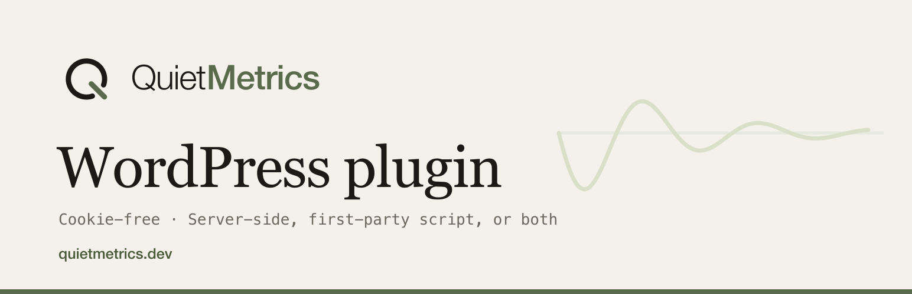

# Quiet Metrics for WordPress



> 🇫🇷 [Version française](README.fr.md)

Official WordPress plugin for Quiet Metrics (La Boîte à Code): audience measurement with no identification or tracking cookies, with first-party script collection, unblockable 100% server-side tracking, or both. No Composer dependency for the end user: the PHP SDK and the JS tracker are embedded.

## Installation

Manual installation (developers, agencies):

```bash
cp -R packages/wordpress-plugin /path/to/site/wp-content/plugins/quiet-metrics
```

Then:

1. Activate "Quiet Metrics" in Plugins.
2. Open Settings > Quiet Metrics and paste the site's public key (`qm_pub_...`).
3. Pick the collection mode.

No `composer install`: `includes/Client.php` is an embedded copy of the core SDK ([php-metrics](https://github.com/Quiet-Metrics/php-metrics)) and `assets/qm.js` a copy of the tracker ([tracker-js](https://github.com/Quiet-Metrics/tracker-js)).

## Configuration

Everything lives in Settings > Quiet Metrics (single `quiet_metrics_settings` option):

| Setting | Default | Role |
|---|---|---|
| Site public key | empty | identifies the site (`qm_pub_...`); nothing is sent without it |
| Secret key | empty | signed server mode (HMAC): the visitor's IP, User-Agent and timestamp are trusted |
| Service URL | `https://quietmetrics.dev` | Quiet Metrics instance receiving hits on `/api/v1/collect` |
| Collection mode | script | `script`, `server` or `both` |
| Excluded roles | administrator, editor | logged-in users never counted (both modes) |
| Excluded paths | empty | URL prefixes, one per line (e.g. `/staging`) |

## Usage

### Script mode (first-party)

The plugin enqueues the local copy `assets/qm.js` with `defer` and the `data-site` and `data-endpoint` attributes. The `data-endpoint` points to the site's own REST route (`POST /wp-json/quiet-metrics/v1/collect`), which relays the raw body to `{service}/api/v1/collect` (2 s timeout, non-blocking, original `X-Forwarded-For` and `User-Agent` headers forwarded): the browser never talks to a third-party domain.

Custom event in the browser (built-in queue, callable before the script loads):

```html
<script>
  qm('signup', { plan: 'pro' });
</script>
```

### Server mode (unblockable)

Every page view from a non-excluded visitor is sent by PHP: decision on `template_redirect`, sending on `shutdown` through the embedded SDK (fire-and-forget socket, 400 ms cURL fallback, silent errors). Zero JavaScript, nothing to block browser-side.

Custom event in PHP, from a theme or a plugin:

```php
add_action( 'woocommerce_thankyou', function ( $order_id ) {
    quiet_metrics_event( 'purchase', array( 'order' => $order_id ) );
} );
```

The embedded SDK remains directly usable for advanced options (same signatures as `quiet-metrics/php-metrics`):

```php
$client = quiet_metrics_client(); // \QuietMetrics\Client|null
if ( $client !== null ) {
    $client->pageview( array( 'url' => 'https://mysite.com/virtual-page' ) );
}
```

## Opting out of measurement

A visitor can ask to stop being counted, with no account and without writing to anyone: they visit a page of your site with `?qm_ignore=1`, and `?qm_ignore=0` puts them back into measurement.

```
https://mysite.com/?qm_ignore=1     stop being counted
https://mysite.com/?qm_ignore=0     be counted again
```

The marker is a **first-party cookie of your own site**, named `qm_ignore` with the value `1` (`path=/`, `samesite=lax`, `secure` over https, five years). The plugin takes care of it, with no setting to touch: it stores or clears the marker, and nothing is sent while it is there.

It holds no identifier (its value is the same for everyone), it is never transmitted to Quiet Metrics, and it exists only to stop measurement: it is an opt-out marker, not a tracker. The JS tracker additionally writes the same value to `localStorage`, but a server-side SDK only ever reads the cookie: one visit therefore covers all three collection modes of the plugin: script, server, or both.

This does not replace the excluded roles and paths in the settings: those belong to the site administrator, the marker belongs to the visitor.

## Visit continuity

When the visitor fingerprint changes mid-visit (4G, then wifi), the same person would otherwise be counted as two unique visitors on the same day. A second **first-party cookie of your own site** closes that gap: `qm_visit`, value `1` (`path=/`, `samesite=lax`, `secure` over https), on a sliding ten-minute window pushed back by every measured hit. Each hit reports whether it was already there as the `c` key of the payload.

Its value is a constant, the same for everyone, so it identifies nobody: it only says that a visit is already under way in this browser. It is never written to someone who has set the opt-out marker, and never written when nothing is measured. The plugin takes care of it with no setting to touch, in server mode as in script mode.

Note for cached sites: a measured response now carries a `Set-Cookie` header, which some reverse proxies and CDNs treat as a reason not to store the response.

## How it works

- Ignored in server mode: admin, AJAX, cron, REST, XML-RPC requests, previews, feeds, robots, excluded roles and excluded paths. In script mode, excluded roles never receive the script and excluded paths are passed to the tracker via `data-exclude`.
- With the secret key, the SDK signs every hit: `X-QM-Timestamp` and `X-QM-Signature` headers (HMAC SHA-256 of `{timestamp}.{body}`), per the monorepo spec `docs/05-api-et-sdk.md`.
- Uninstalling (`uninstall.php`) removes the `quiet_metrics_settings` option, multisite included. The plugin creates no table.

## wordpress.org directory assets

The [`.wordpress-org/`](.wordpress-org/) folder holds the visuals in the plugin directory's official formats, ready for the SVN `assets/` folder at submission time: `banner-1544x500.png` (retina), `banner-772x250.png`, `icon-256x256.png`, `icon-128x128.png` (source `icon.svg`).

## License

GPLv2 or later (a wordpress.org directory requirement). The embedded SDK comes from the `quiet-metrics/php-metrics` package, published under the MIT license, GPL-compatible.

A [La Boîte à Code](https://laboiteacode.fr) plugin for [Quiet Metrics](https://quietmetrics.dev).
